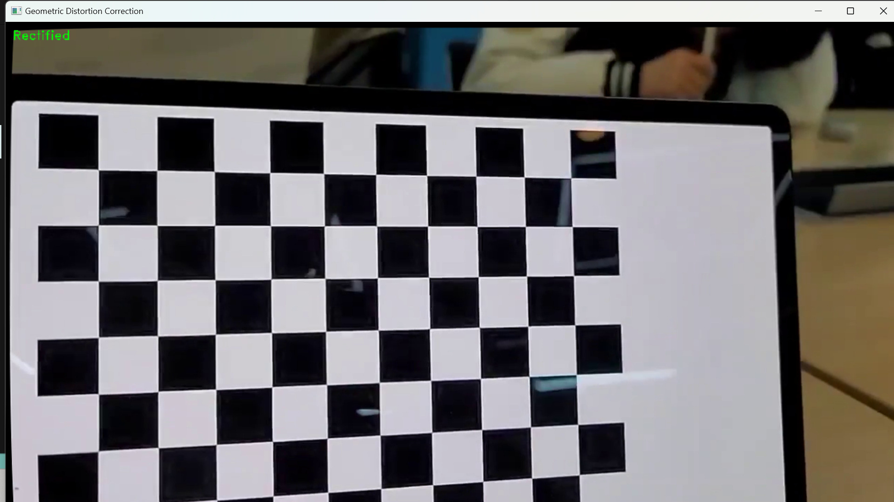

# camera-calibration 
## Camera Calibration Results
* The number of selected images = 1
* RMS error = 0.3485953152997315
* Camera matrix (K) =
[[1.61468833e+03 0.00000000e+00 7.35011025e+02]
 [0.00000000e+00 1.60790916e+03 3.04398676e+02]
 [0.00000000e+00 0.00000000e+00 1.00000000e+00]]
* Distortion coefficient (k1, k2, p1, p2, k3, ...) = [ 6.87631961e-02 -1.30859644e-01 -7.19549309e-04  2.04361148e-03      
 -8.61803094e-01]
## Lens distortion_correction demo

